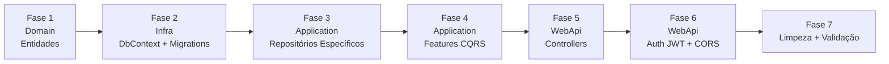

# Plano de Implementação — FacilitaRH API (.NET 8)

> Migração da API TypeScript/Express → .NET 8 Clean Architecture + CQRS  
> Baseado na [DOCUMENTATION.md](file:///c:/Users/Vinicius/Documents/GitHub/Backend-FacilitaRH/FacilitaRhApi/DOCUMENTATION.md)

---

## Estado Atual do Projeto

A arquitetura já está montada com 4 camadas:

| Camada             | Projeto                        | O que já existe                                                                                                                                                                 |
| ------------------ | ------------------------------ | ------------------------------------------------------------------------------------------------------------------------------------------------------------------------------- |
| **Domain**         | `FacilitaRhApi.Domain`         | `Result<T>`, `Error`, `ErrorType` enum                                                                                                                                          |
| **Application**    | `FacilitaRhApi.Application`    | MediatR + FluentValidation configurados, `ICommand/IQuery`, `ICommandHandler/IQueryHandler`, 5 Pipeline Behaviors, `IRepositoryBase<T>`, `IUnitOfWork`, SampleFeature (exemplo) |
| **Infrastructure** | `FacilitaRhApi.Infrastructure` | `AppDbContext` (vazio), `UnitOfWork` + `RepositoryBase<T>` genérico, PostgreSQL via Npgsql                                                                                      |
| **WebApi**         | `FacilitaRhApi.WebApi`         | `Program.cs` (Serilog, OpenTelemetry, Swagger), `ApiControllerBase` com `HandleFailure()`, `GlobalExceptionHandler`, JWT Bearer já referenciado no .csproj                      |

> [!IMPORTANT]
> O que **falta implementar**: entidades de domínio, DbSets, migrations, repositórios específicos, todas as Features CQRS, Controllers, autenticação JWT, e CORS.

---

## Visão Geral das Fases



---

## Fase 1 — Domain: Entidades e Erros de Domínio

> [!NOTE]
> Todas as entidades vão em `src/Domain/Models/`. Corrigimos os bugs identificados na documentação (ex.: passwords expostas, campos UNIQUE globais).

### Tarefa 1.1 — Criar entidade `User` (com ASP.NET Core Identity)

**Arquivo:** `src/Domain/Models/User.cs`

> [!IMPORTANT]
> A entidade `User` herda de `IdentityUser`, que já fornece `Id` (string GUID), `Email`, `UserName`, `PasswordHash`, etc. Adicionamos apenas o campo extra `Name`.

```csharp
using Microsoft.AspNetCore.Identity;

namespace FacilitaRhApi.Domain.Models;

public class User : IdentityUser
{
    public string Name { get; set; } = string.Empty;
}
```

> **Nota:** O `Id` do Identity é `string` (GUID). Os campos `Email`, `PasswordHash`, `UserName` já vêm do `IdentityUser`. O Domain precisará referenciar o pacote `Microsoft.AspNetCore.Identity.EntityFrameworkCore` ou `Microsoft.Extensions.Identity.Stores`.

### Tarefa 1.2 — Criar entidade `Vacancy`

**Arquivo:** `src/Domain/Models/Vacancy.cs`

```csharp
namespace FacilitaRhApi.Domain.Models;

public class Vacancy
{
    public int Id { get; set; }
    public string Status { get; set; } = string.Empty;
    public string Titulo { get; set; } = string.Empty;
    public int QtdeVagas { get; set; }
    public string Descricao { get; set; } = string.Empty;
    public string Setor { get; set; } = string.Empty;
    public string Senioridade { get; set; } = string.Empty;
    public string Diversidade { get; set; } = string.Empty;
    public string Pcd { get; set; } = string.Empty;
    public string Salario { get; set; } = string.Empty;
    public string Contrato { get; set; } = string.Empty;
    public string Turno { get; set; } = string.Empty;
    public string Local { get; set; } = string.Empty;
    public string Endereco { get; set; } = string.Empty;
    public string DataAbertura { get; set; } = string.Empty;
    public string DataFechamento { get; set; } = string.Empty;

    // Navigation
    public ICollection<Application> Applications { get; set; } = new List<Application>();
}
```

### Tarefa 1.3 — Criar entidade `Application`

**Arquivo:** `src/Domain/Models/Application.cs`

```csharp
namespace FacilitaRhApi.Domain.Models;

public class Application
{
    public int Id { get; set; }
    public int VacancyId { get; set; }
    public string NomeCompleto { get; set; } = string.Empty;
    public string Email { get; set; } = string.Empty;
    public string Telefone { get; set; } = string.Empty;
    public string DataNasc { get; set; } = string.Empty;
    public string Cpf { get; set; } = string.Empty;
    public string ResumoProfissional { get; set; } = string.Empty;
    public string Cargo { get; set; } = string.Empty;
    public string Empresa { get; set; } = string.Empty;
    public string DataInicioEmpresa { get; set; } = string.Empty;
    public string DataTerminoEmpresa { get; set; } = string.Empty;
    public string DescricaoATVD { get; set; } = string.Empty;
    public string Situacao { get; set; } = string.Empty;
    public string Escolaridade { get; set; } = string.Empty;
    public string Curso { get; set; } = string.Empty;
    public string Instituicao { get; set; } = string.Empty;
    public string DataInicioEstudo { get; set; } = string.Empty;
    public string DataTerminoEstudos { get; set; } = string.Empty;

    // Navigation
    public Vacancy? Vacancy { get; set; }
}
```

### Tarefa 1.4 — Atualizar erros de domínio

**Arquivo:** `src/Domain/Abstractions/Error.cs` — substituir os erros de exemplo por erros do FacilitaRH:

```csharp
public static class UserErrors
{
    public static Error EmailAlreadyRegistered => new("User.EmailAlreadyRegistered", ErrorType.Validation, "This email has been already registered.");
    public static Error NotFound => new("User.NotFound", ErrorType.NotFound, "User not found.");
    public static Error InvalidPassword => new("User.InvalidPassword", ErrorType.Validation, "Invalid password.");
    public static Error CreationFailed => new("User.CreationFailed", ErrorType.Validation, "Failed to create user.");
    public static Error SecretNotConfigured => new("User.SecretNotConfigured", ErrorType.Validation, "JWT Secret is not configured.");
}

public static class VacancyErrors
{
    public static Error NotFound => new("Vacancy.NotFound", ErrorType.NotFound, "Vacancy not found.");
    public static Error MissingData => new("Vacancy.MissingData", ErrorType.Validation, "Please provide all informations.");
}

public static class ApplicationErrors
{
    public static Error AlreadyApplied => new("Application.AlreadyApplied", ErrorType.Validation, "Already applied to this job vacancy.");
    public static Error NoneFound => new("Application.NoneFound", ErrorType.NotFound, "There are no applications.");
}
```

### Tarefa 1.5 — Adicionar pacote Identity ao Domain

```bash
dotnet add src/Domain/FacilitaRhApi.Domain.csproj package Microsoft.Extensions.Identity.Stores
```

> Necessário para que `User` herde de `IdentityUser`. Usamos o pacote mais leve (`Identity.Stores`) para manter o Domain sem dependência do ASP.NET Core.

### Tarefa 1.6 — Remover `Class1.cs`

Excluir `src/Domain/Class1.cs` (arquivo boilerplate).

---

## Fase 2 — Infrastructure: DbContext (Identity), Configurações e Migrations

### Tarefa 2.1 — Instalar pacote Identity no Infrastructure

```bash
dotnet add src/Infrastructure/FacilitaRhApi.Infrastructure.csproj package Microsoft.AspNetCore.Identity.EntityFrameworkCore
```

### Tarefa 2.2 — Configurar `AppDbContext` com Identity

**Arquivo:** `src/Infrastructure/AppDbContext.cs`

> [!IMPORTANT]
> O `AppDbContext` agora herda de `IdentityDbContext<User>` em vez de `DbContext`. Isso cria automaticamente as tabelas do Identity (AspNetUsers, AspNetRoles, etc.).

```csharp
using Microsoft.AspNetCore.Identity.EntityFrameworkCore;
using Microsoft.EntityFrameworkCore;
using FacilitaRhApi.Domain.Models;

namespace FacilitaRhApi.Infrastructure;

public class AppDbContext : IdentityDbContext<User>
{
    public AppDbContext(DbContextOptions<AppDbContext> options) : base(options) { }

    public DbSet<Vacancy> Vacancies { get; set; }
    public DbSet<Application> Applications { get; set; }

    protected override void OnModelCreating(ModelBuilder modelBuilder)
    {
        base.OnModelCreating(modelBuilder); // OBRIGATÓRIO para Identity
        modelBuilder.ApplyConfigurationsFromAssembly(typeof(AppDbContext).Assembly);
    }
}
```

> **Nota:** Não é preciso `DbSet<User>` — o `IdentityDbContext<User>` já gerencia isso via `Users`.

### Tarefa 2.3 — Criar Entity Configurations

**Arquivos:**

- `src/Infrastructure/Configurations/VacancyConfiguration.cs`
- `src/Infrastructure/Configurations/ApplicationConfiguration.cs`

Cada um implementando `IEntityTypeConfiguration<T>` para separar a configuração do `OnModelCreating`.

- `Application.Email` → `UNIQUE`
- `Application.Cpf` → `UNIQUE`
- `Application.VacancyId` → FK para `Vacancy.Id`
- Todos os campos `string` como `NOT NULL` (required)

> **Nota:** Não precisamos de `UserConfiguration` — o Identity já configura índice UNIQUE no Email.

### Tarefa 2.4 — Configurar Identity no DI (Infrastructure)

**Arquivo:** `src/Infrastructure/DependencyInjection.cs` — adicionar configuração do Identity:

```csharp
services.AddIdentity<User, IdentityRole>(options =>
{
    options.Password.RequireDigit = false;
    options.Password.RequireLowercase = false;
    options.Password.RequireUppercase = false;
    options.Password.RequireNonAlphanumeric = false;
    options.Password.RequiredLength = 1;
    options.User.RequireUniqueEmail = true;
})
.AddEntityFrameworkStores<AppDbContext>()
.AddDefaultTokenProviders();
```

> As regras de senha estão flexíveis para manter compatibilidade com o sistema original. Ajustar conforme necessário.

### Tarefa 2.5 — Configurar Connection String

**Arquivo:** `src/WebApi/appsettings.Development.json`

```json
{
  "ConnectionStrings": {
    "DefaultConnection": "Host=localhost;Port=5432;Database=facilitarh;Username=postgres;Password=postgres"
  }
}
```

### Tarefa 2.6 — Instalar EF Core Tools e criar Migration inicial

```bash
dotnet tool install --global dotnet-ef  # se ainda não instalado
dotnet ef migrations add InitialCreate --project src/Infrastructure --startup-project src/WebApi
dotnet ef database update --project src/Infrastructure --startup-project src/WebApi
```

### Tarefa 2.7 — Remover `Class1.cs`

Excluir `src/Infrastructure/Class1.cs`.

---

## Fase 3 — Application: Repositórios Específicos

> [!NOTE]
> O `IRepositoryBase<T>` genérico já existe. Para **Users**, **não criamos repositório** — o `UserManager<User>` do Identity já fornece todas as operações (busca por email, criação com hash automático, validação de senha). Repositórios específicos são apenas para `Vacancy` e `Application`.

### Tarefa 3.1 — Criar `IVacancyRepository`

**Arquivo:** `src/Application/Repositories/IVacancyRepository.cs`

```csharp
public interface IVacancyRepository : IRepositoryBase<Vacancy>
{
    // Usa apenas métodos do IRepositoryBase por enquanto
}
```

### Tarefa 3.2 — Criar `IApplicationRepository`

**Arquivo:** `src/Application/Repositories/IApplicationRepository.cs`

```csharp
public interface IApplicationRepository : IRepositoryBase<Application>
{
    Task<Application?> GetByEmailOrCpfAsync(string email, string cpf);
    Task<IEnumerable<Application>> GetByVacancyIdAsync(int vacancyId);
}
```

### Tarefa 3.3 — Implementar repositórios na Infrastructure

**Arquivos:**

- `src/Infrastructure/Repositories/VacancyRepository.cs`
- `src/Infrastructure/Repositories/ApplicationRepository.cs`

Cada um herdando de `RepositoryBase<T>` (que precisará ser `public`) e implementando a interface específica.

> **Nota sobre Users:** Não há `UserRepository`. Os handlers de User injetam `UserManager<User>` e `SignInManager<User>` diretamente.

### Tarefa 3.4 — Registrar repositórios no DI

**Arquivo:** `src/Infrastructure/DependencyInjection.cs` — adicionar:

```csharp
services.AddScoped<IVacancyRepository, VacancyRepository>();
services.AddScoped<IApplicationRepository, ApplicationRepository>();
```

> `UserManager<User>` e `SignInManager<User>` já são registrados automaticamente pelo `AddIdentity()` na Fase 2.

### Tarefa 3.5 — Remover `Class1.cs`

Excluir `src/Application/Class1.cs`.

---

## Fase 4 — Application: Features CQRS

> [!IMPORTANT]
> Cada operação da API vira um par Command/Query + Handler dentro de `src/Application/Features/`. Validators são criados com FluentValidation.

### Estrutura de pastas alvo:

```
src/Application/Features/
├── Users/
│   ├── CreateUser/
│   │   ├── CreateUserCommand.cs
│   │   ├── CreateUserCommandHandler.cs
│   │   └── CreateUserCommandValidator.cs
│   ├── AuthenticateUser/
│   │   ├── AuthenticateUserCommand.cs
│   │   ├── AuthenticateUserCommandHandler.cs
│   │   ├── AuthenticateUserCommandValidator.cs
│   │   └── AuthenticateUserResponse.cs
│   └── GetUsers/
│       ├── GetUsersQuery.cs
│       ├── GetUsersQueryHandler.cs
│       └── UserResponse.cs
├── Vacancies/
│   ├── CreateVacancy/
│   │   ├── CreateVacancyCommand.cs
│   │   ├── CreateVacancyCommandHandler.cs
│   │   └── CreateVacancyCommandValidator.cs
│   ├── GetVacancies/
│   │   ├── GetVacanciesQuery.cs
│   │   └── GetVacanciesQueryHandler.cs
│   ├── GetVacancyById/
│   │   ├── GetVacancyByIdQuery.cs
│   │   └── GetVacancyByIdQueryHandler.cs
│   ├── UpdateVacancy/
│   │   ├── UpdateVacancyCommand.cs
│   │   ├── UpdateVacancyCommandHandler.cs
│   │   └── UpdateVacancyCommandValidator.cs
│   └── DeleteVacancy/
│       ├── DeleteVacancyCommand.cs
│       └── DeleteVacancyCommandHandler.cs
├── Applications/
│   ├── CreateApplication/
│   │   ├── CreateApplicationCommand.cs
│   │   ├── CreateApplicationCommandHandler.cs
│   │   └── CreateApplicationCommandValidator.cs
│   ├── GetApplicationsByVacancy/
│   │   ├── GetApplicationsByVacancyQuery.cs
│   │   └── GetApplicationsByVacancyQueryHandler.cs
│   └── GetAllApplications/
│       ├── GetAllApplicationsQuery.cs
│       └── GetAllApplicationsQueryHandler.cs
└── Statistics/
    ├── GetStatistics/
    │   ├── GetStatisticsQuery.cs
    │   ├── GetStatisticsQueryHandler.cs
    │   └── GetStatisticsResponse.cs
```

### Tarefa 4.1 — Feature `CreateUser` (via Identity)

| Arquivo                                                         | Responsabilidade                                                                                                                                |
| --------------------------------------------------------------- | ----------------------------------------------------------------------------------------------------------------------------------------------- |
| `CreateUserCommand(string Name, string Email, string Password)` | `ICommand<string>` (retorna o `Id` string do Identity)                                                                                          |
| `CreateUserCommandValidator`                                    | Valida campos obrigatórios e formato de email                                                                                                   |
| `CreateUserCommandHandler`                                      | Injeta `UserManager<User>` → `FindByEmailAsync` → se existe, retorna erro → `CreateAsync(user, password)` (hash automático) → retorna `user.Id` |

> [!WARNING]
> **Bug corrigido #1 e #4:** Early return quando email já existe + Identity nunca expõe hash de senha.

> [!TIP]
> O `UserManager.CreateAsync(user, password)` já faz o hash da senha automaticamente. Não precisamos de BCrypt!

### Tarefa 4.2 — Feature `AuthenticateUser` (via Identity)

| Arquivo                                                  | Responsabilidade                                                                                                                                    |
| -------------------------------------------------------- | --------------------------------------------------------------------------------------------------------------------------------------------------- |
| `AuthenticateUserCommand(string Email, string Password)` | `ICommand<AuthenticateUserResponse>`                                                                                                                |
| `AuthenticateUserResponse`                               | `record(string Id, string Email, string Token)` — **Id é string (GUID do Identity)**                                                                |
| `AuthenticateUserCommandValidator`                       | Valida email e password obrigatórios                                                                                                                |
| `AuthenticateUserCommandHandler`                         | Injeta `UserManager<User>` + `IJwtTokenGenerator` → `FindByEmailAsync` → `CheckPasswordAsync(user, password)` → gera JWT (1 dia) → retorna response |

> Necessita injeção de `IJwtTokenGenerator` (criado na Fase 6) para gerar o token JWT.

### Tarefa 4.3 — Feature `GetUsers` (via Identity)

| Arquivo                | Responsabilidade                                                                |
| ---------------------- | ------------------------------------------------------------------------------- |
| `GetUsersQuery`        | `IQuery<IEnumerable<UserResponse>>`                                             |
| `UserResponse`         | `record(string Id, string Name, string Email)` — **sem password, Id é string**  |
| `GetUsersQueryHandler` | Injeta `UserManager<User>` → `Users.ToListAsync()` → mapeia para `UserResponse` |

> [!WARNING]
> **Bug corrigido #4:** `UserResponse` não expõe o campo `Password`. O Identity jamais retorna o hash nas consultas padrão.

### Tarefa 4.4 — Feature `CreateVacancy`

| Arquivo                                          | Responsabilidade            |
| ------------------------------------------------ | --------------------------- |
| `CreateVacancyCommand(...)` — todos os 15 campos | `ICommand<int>`             |
| `CreateVacancyCommandValidator`                  | Valida campos obrigatórios  |
| `CreateVacancyCommandHandler`                    | Cria e salva → retorna `id` |

### Tarefa 4.5 — Feature `GetVacancies`

| `GetVacanciesQuery` | `IQuery<IEnumerable<Vacancy>>` |
| `GetVacanciesQueryHandler` | Retorna `GetAllAsync()` |

### Tarefa 4.6 — Feature `GetVacancyById`

| `GetVacancyByIdQuery(int Id)` | `IQuery<Vacancy>` |
| `GetVacancyByIdQueryHandler` | Busca por ID → se null retorna `VacancyErrors.NotFound` |

> [!WARNING]
> **Bug corrigido #3:** Retorna 404 quando a vaga não existe, em vez de `{ vacancy: null }` com status 200.

### Tarefa 4.7 — Feature `UpdateVacancy`

| `UpdateVacancyCommand(int Id, ...)` — todos os campos | `ICommand` |
| `UpdateVacancyCommandValidator` | Valida campos obrigatórios |
| `UpdateVacancyCommandHandler` | Busca → se null retorna erro → atualiza todos os campos → salva |

### Tarefa 4.8 — Feature `DeleteVacancy`

| `DeleteVacancyCommand(int Id)` | `ICommand` |
| `DeleteVacancyCommandHandler` | Busca → se null retorna `VacancyErrors.NotFound` → deleta |

> [!WARNING]
> **Bug corrigido #2:** Verifica existência ANTES de deletar, em vez de confiar na exceção do ORM.

### Tarefa 4.9 — Feature `CreateApplication`

| `CreateApplicationCommand(int VacancyId, ...)` — todos os 17 campos | `ICommand<int>` |
| `CreateApplicationCommandValidator` | Valida campos obrigatórios |
| `CreateApplicationCommandHandler` | Verifica duplicidade (email OU cpf) → cria → retorna `id` |

### Tarefa 4.10 — Feature `GetApplicationsByVacancy`

| `GetApplicationsByVacancyQuery(int VacancyId)` | `IQuery<IEnumerable<Application>>` |
| `GetApplicationsByVacancyQueryHandler` | Filtra por vacancyId → retorna lista (vazia = `200` com lista vazia) |

### Tarefa 4.11 — Feature `GetAllApplications`

| `GetAllApplicationsQuery` | `IQuery<IEnumerable<Application>>` |
| `GetAllApplicationsQueryHandler` | Retorna todos → se vazio, retorna `ApplicationErrors.NoneFound` |

### Tarefa 4.12 — Feature `GetStatistics`

| `GetStatisticsQuery` | `IQuery<GetStatisticsResponse>` |
| `GetStatisticsResponse` | Record com `TempoMedio`, `Vacancies`, `VagasPorSetor`, `VagasPorMes`, `Candidates` |
| `GetStatisticsQueryHandler` | Calcula tempo médio (com guard `length > 0`), agrupa por mês, agrupa por setor (14 setores fixos com cores) |

> [!WARNING]
> **Bug corrigido #5:** Verifica `vacancies.Count > 0` antes de calcular `tempoMedio` para evitar divisão por zero.

### Tarefa 4.13 — Remover `SampleFeature`

Excluir `src/Application/Features/SampleFeature/` inteiro.

---

## Fase 5 — WebApi: Controllers

### Tarefa 5.1 — `UsersController`

**Arquivo:** `src/WebApi/Controllers/UsersController.cs`

| Rota               | Método         | Handler MediatR                            |
| ------------------ | -------------- | ------------------------------------------ |
| `POST /users`      | `Create`       | `CreateUserCommand`                        |
| `POST /users/auth` | `Authenticate` | `AuthenticateUserCommand`                  |
| `GET /users`       | `GetAll`       | `GetUsersQuery` — **requer `[Authorize]`** |

### Tarefa 5.2 — `VacanciesController`

**Arquivo:** `src/WebApi/Controllers/VacanciesController.cs`

| Rota                     | Método    | Handler MediatR        |
| ------------------------ | --------- | ---------------------- |
| `POST /vacancies`        | `Create`  | `CreateVacancyCommand` |
| `GET /vacancies`         | `GetAll`  | `GetVacanciesQuery`    |
| `GET /vacancies/{id}`    | `GetById` | `GetVacancyByIdQuery`  |
| `PUT /vacancies/{id}`    | `Update`  | `UpdateVacancyCommand` |
| `DELETE /vacancies/{id}` | `Delete`  | `DeleteVacancyCommand` |

### Tarefa 5.3 — `ApplicationsController`

**Arquivo:** `src/WebApi/Controllers/ApplicationsController.cs`

| Rota                             | Método         | Handler MediatR                 |
| -------------------------------- | -------------- | ------------------------------- |
| `GET /applications`              | `GetAll`       | `GetAllApplicationsQuery`       |
| `POST /applications/{vacancyId}` | `Apply`        | `CreateApplicationCommand`      |
| `GET /applications/{vacancyId}`  | `GetByVacancy` | `GetApplicationsByVacancyQuery` |

### Tarefa 5.4 — `StatisticsController`

**Arquivo:** `src/WebApi/Controllers/StatisticsController.cs`

| Rota              | Método | Handler MediatR      |
| ----------------- | ------ | -------------------- |
| `GET /statistics` | `Get`  | `GetStatisticsQuery` |

### Tarefa 5.5 — Atualizar `ApiControllerBase`

Adicionar `ErrorType.Unauthorized` no switch de `HandleFailure`:

```csharp
ErrorType.Unauthorized => Unauthorized(result.Error.Description),
```

---

## Fase 6 — WebApi: Autenticação JWT + CORS

### Tarefa 6.1 — Configurar JWT no `appsettings.json`

```json
{
  "JwtSettings": {
    "Secret": "SUA_CHAVE_SECRETA_AQUI_MIN_32_CHARS",
    "ExpiresInHours": 24,
    "Issuer": "FacilitaRhApi",
    "Audience": "FacilitaRhApi"
  }
}
```

### Tarefa 6.2 — Configurar autenticação JWT no `Program.cs`

- Ler `JwtSettings` do `appsettings.json`
- Configurar `AddAuthentication().AddJwtBearer()` com validação de `Secret`, `Issuer`, `Audience`
- Adicionar `app.UseAuthentication()` antes de `app.UseAuthorization()`

### Tarefa 6.3 — Configurar CORS no `Program.cs`

```csharp
builder.Services.AddCors(options =>
{
    options.AddDefaultPolicy(policy =>
    {
        policy.WithOrigins("https://facilita-rh.netlify.app")
              .AllowAnyHeader()
              .AllowAnyMethod();
    });
});
// ...
app.UseCors();
```

### Tarefa 6.4 — Criar service `IJwtTokenGenerator`

**Arquivo:** `src/Application/Abstractions/IJwtTokenGenerator.cs`

```csharp
public interface IJwtTokenGenerator
{
    string GenerateToken(string userId, string email);
}
```

> **Nota:** O `userId` agora é `string` (GUID do Identity), não `int`.

**Arquivo:** `src/Infrastructure/Authentication/JwtTokenGenerator.cs`

Implementação usando `System.IdentityModel.Tokens.Jwt`. Gera token com claims `sub` (userId) e `email`, expirando em 1 dia.

### Tarefa 6.5 — Registrar `IJwtTokenGenerator` no DI

**Arquivo:** `src/Infrastructure/DependencyInjection.cs`

---

## Fase 7 — Limpeza e Validação Final

### Tarefa 7.1 — Remover arquivos boilerplate

- [x] `src/Domain/Class1.cs`
- [x] `src/Application/Class1.cs`
- [x] `src/Infrastructure/Class1.cs`
- [x] `src/Application/Features/SampleFeature/` (pasta inteira)

### Tarefa 7.2 — Remover erros de exemplo

Limpar `Errors.AccountNotFound` e `Errors.InsufficientFunds` do `Error.cs`.

### Tarefa 7.3 — Instalar pacote JWT no Infrastructure

```bash
dotnet add src/Infrastructure/FacilitaRhApi.Infrastructure.csproj package System.IdentityModel.Tokens.Jwt
```

> **Nota:** `BCrypt.Net-Next` **NÃO é necessário** — o Identity gerencia hashing de senhas automaticamente. O pacote `Microsoft.AspNetCore.Authentication.JwtBearer` já está referenciado no WebApi.

### Tarefa 7.5 — Build e Teste

```bash
dotnet build FacilitaRhApi.sln
dotnet ef database update --project src/Infrastructure --startup-project src/WebApi
dotnet run --project src/WebApi
```

Verificar via Swagger (`/swagger`) que todas as 12 rotas aparecem e respondem corretamente.

---

## Resumo de Bugs Corrigidos na Migração

| #   | Bug Original                                        | Correção Aplicada                                         | Fase |
| --- | --------------------------------------------------- | --------------------------------------------------------- | ---- |
| 1   | Falta `return` após email duplicado em `CreateUser` | Result Pattern com early return + `UserManager`           | 4.1  |
| 2   | `if (!vacancy)` após delete é código morto          | Verificar existência ANTES de deletar                     | 4.8  |
| 3   | Vaga inexistente retorna `200 { vacancy: null }`    | Retorna `404 VacancyErrors.NotFound`                      | 4.6  |
| 4   | Hash de senha exposto nas respostas                 | Identity nunca expõe hash + `UserResponse` sem `Password` | 4.3  |
| 5   | `tempoMedio = NaN` quando sem vagas                 | Guard `Count > 0` antes da divisão                        | 4.12 |
| 6   | Unicidade email/CPF global nas candidaturas         | Mantido conforme original (avaliar)                       | 4.9  |
| 7   | Rotas de vagas sem autenticação                     | Mantido conforme original (avaliar)                       | —    |

---

## Ordem de Execução Sugerida

```
Fase 1 (1.1 → 1.5) → Fase 2 (2.1 → 2.5) → Fase 3 (3.1 → 3.6)
→ Fase 4 (4.1 → 4.13) → Fase 5 (5.1 → 5.5) → Fase 6 (6.1 → 6.5)
→ Fase 7 (7.1 → 7.5)
```

> [!TIP]
> Cada fase pode ser validada com `dotnet build` antes de avançar para a próxima. A fase 4 é a mais extensa (13 tarefas) e pode ser dividida por domínio (Users → Vacancies → Applications → Statistics).
